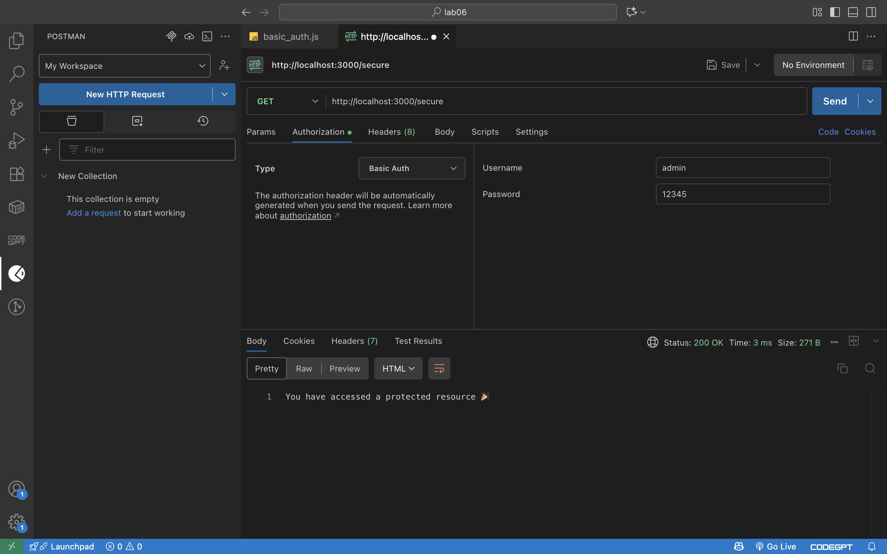
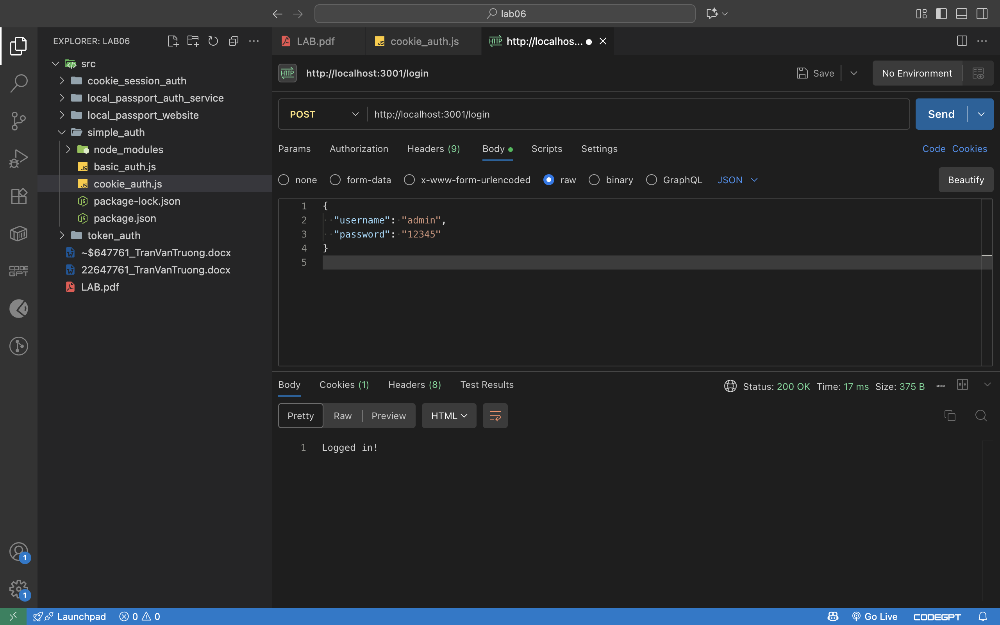
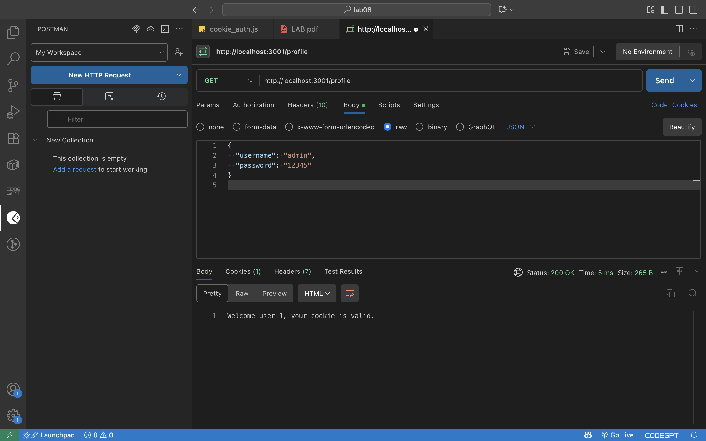
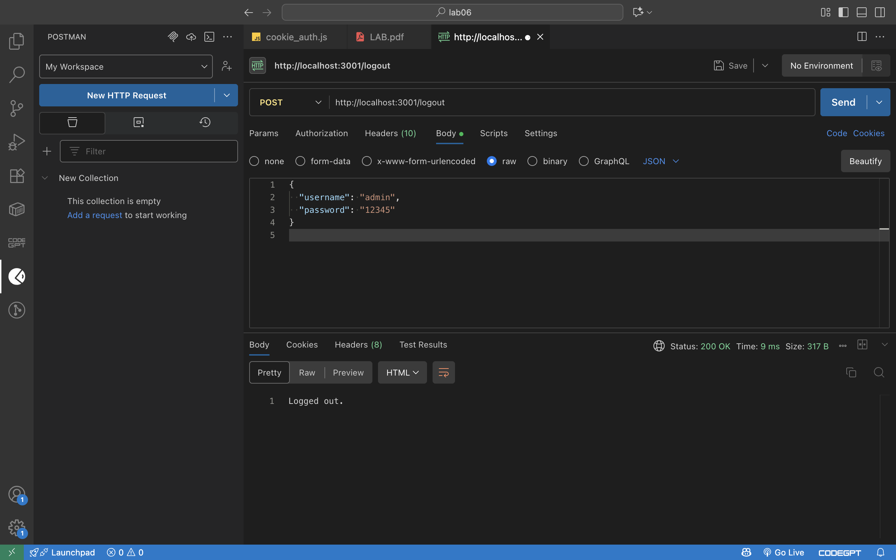
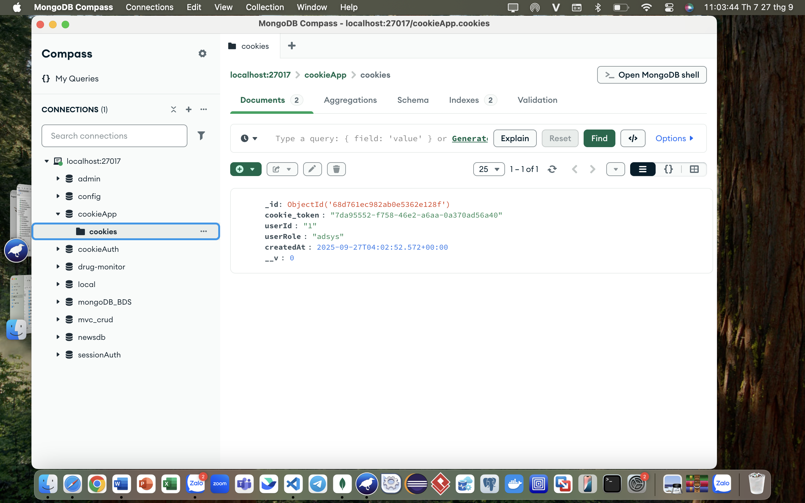

Create five repositories then commiting all source code

Write read me on each repository to show the way you use to test POSTMAN

Using source code provided by lecturer. Read source code and test all
APIs with POSTMAN.

1.  simple_auth source code

    a.  node basic_auth.js.

Hint to add authorization field in request header

{width="7.25in" height="4.53125in"}

- SUCCESS

  a.  node cookie_auth.js Hint to show cookie

-Login\
{width="7.25in" height="4.53125in"}

-Profile\
{width="7.25in" height="4.53125in"}

-Logout\
{width="7.25in" height="4.53125in"}\
Show cookie in mongoDB

{width="7.25in" height="4.53125in"}
